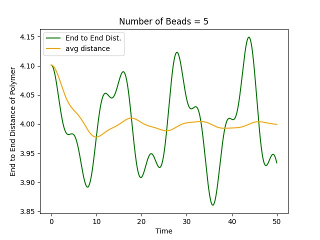
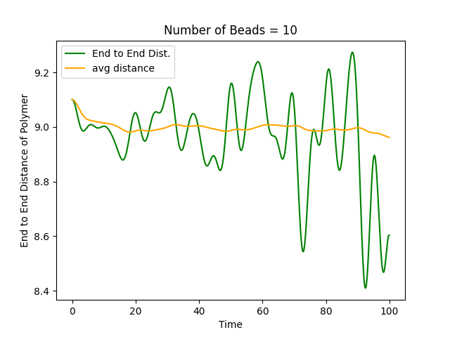
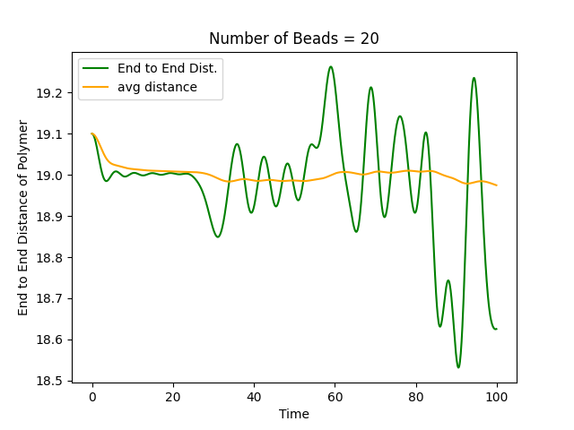
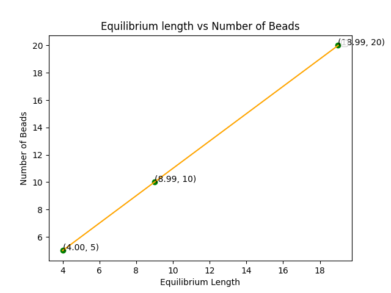

# Polymer Simulation Project
## Overview
Welcome to the Polymer Simulation Project! This repository contains a Python implementation of a simulation for a Gaussian polymer using a bead spring model. The simulation involves point particles connected with Hookean springs, and it calculates the end-to-end distance of the polymer as a function of time for various bead systems. Additionally, it provides insights into the equilibrium end-to-end distance concerning the number of beads.

## Problem Description
Consider a bead spring model for a Gaussian polymer, where point particles are connected with Hookean springs. The equilibrium length of the spring is unity, and the potential energy is given by E/kBT = 1/2k(r − l)^2, where kBT = 1. The goal is to calculate the end-to-end distance as a function of time for 5, 10, and 20 bead systems. The initial configuration should include at least one spring not equal to the equilibrium length.

## Getting Started
To run the simulation and visualize the results, follow these steps:

Explore the generated plots for end-to-end distance vs. time and equilibrium length vs. number of beads.
1. *Plot for End to end distance = 5*
   



2. *Plot for End to end distance = 10*




3. *Plot for End to end distance = 20*
   



4. *Plot for Equilibrium length vs No. of Beads*
   



### Results
The simulation generates insightful visualizations, including graphs of end-to-end distance over time and equilibrium length vs. the number of beads. The code provides a comprehensive understanding of polymer dynamics within the defined bead spring model.

### Dependencies
Ensure you have the following dependencies installed:
1. NumPy
2. Matplotlib
Install them using:

```bash
pip install numpy matplotlib
```
### Contributing
If you find any issues or have suggestions for improvement, feel free to open an issue or create a pull request. 
Your contributions are highly appreciated!
